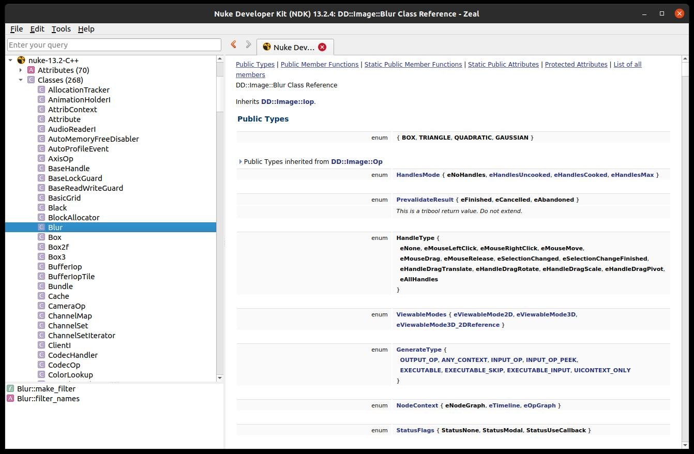

# nuke-docset

## Usage

A command-line utility to create a dash/zeal docset for Nuke.



```
generate.py -h
[nuke-docset]     INFO:  <module>: Starting up...
usage: generate.py [-h] -n NAME [-v] directory

Builds a docset from a directory full of html files.

positional arguments:
  directory

optional arguments:
  -h, --help            show this help message and exit
  -n NAME, --name NAME
  -v, --verbose

[nuke-docset]     INFO:  <module>: done !
```

typical usage:
```
./generate.py -n nuke-13.2-C++ -v /opt/foundry/Nuke13.2v4/Documentation/NDKExamples/Plugins
```


## License

This is released under the Unlicense. See LICENSE.md for details.

## Author

Philippe Leprince
